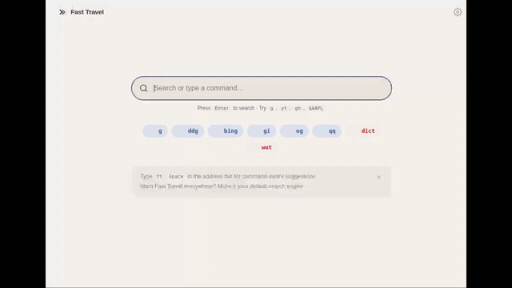

# Fast Travel App

**Supercharge your search bar.** Turn your search bar into a command line for the web. Define short triggers and jump straight to the sites and searches you use most — available as a browser extension for Chrome and Firefox, and as a native Android app.

> **This is the v2 successor to [fast-travel](https://github.com/DoubleGremlin181/fast-travel).** The original self-hosted static page (v1) remains fully functional and available.

## What you can do

Instead of bookmarks, history, and half-remembered URLs, type a short command and go straight there:

| Type… | …and go to |
|---|---|
| `g kittens` | a Google search for "kittens" |
| `ddg privacy` | the same search on DuckDuckGo |
| `r/technology` | the r/technology subreddit |
| `$AAPL` | an Apple stock quote |
| `yt lofi beats` | a YouTube search |
| `gh fast-travel` | a GitHub search |
| `w black holes` | a Wikipedia article search |
| `apps balatro` | the app on the right store for your device |
| `maps coffee` | nearby coffee on Google Maps |
| `hn` | Hacker News |

Every command is yours to configure — change the triggers, point them anywhere, or add your own.

## Features

- **Command-based navigation** — short triggers route to any site or search you set up.
- **Inline suggestions** — autocomplete as you type, per command, from the search engines you choose.
- **Bring your own config** — keep your commands in a JSON file you host yourself and sync the same setup across every device and browser, or use the built-in defaults and edit them in-app.
- **Device-aware routing** — one command can resolve to the right destination per device (e.g. `apps` opens Steam on desktop, the Play Store on Android).
- **Groups & themes** — organize and personalize your command set, with light/dark modes and multiple styles.
- **Browser extension** — a fast, focused new tab page plus address-bar integration.
- **Android app** — a home-screen widget and the ability to launch installed apps straight from search.
- **Private by design** — no servers, no accounts, no ads, no tracking. Your settings stay on your device.

## Install

| Platform | Link |
|---|---|
| Firefox | [](https://addons.mozilla.org/firefox/addon/fast-travel/) |
| Android | [](https://play.google.com/store/apps/details?id=sh.kavi.fasttravel) |
| Chrome / Chromium | [GitHub Releases](https://github.com/DoubleGremlin181/fast-travel-app/releases/latest) — see below |

### Chrome install (GitHub Releases)

Fast Travel isn't on the Chrome Web Store: its single-purpose policy doesn't allow
one extension to offer both a new tab page and search-engine integration, and
splitting or stripping the extension would defeat the point. Install it from the
[latest release](https://github.com/DoubleGremlin181/fast-travel-app/releases/latest)
instead:

1. Download `chrome-extension.zip` and extract it to a folder you'll keep around
   (Chrome loads the extension from that folder).
2. Open `chrome://extensions`, enable **Developer mode** (top right).
3. Click **Load unpacked** and select the extracted folder.

Heads up: unpacked extensions don't auto-update. Fast Travel shows a notice on the
new tab page when a newer release is available — download the new zip, extract it
over the same folder, and hit the reload icon on `chrome://extensions`.

### Direct download (GitHub Releases)

Every release also ships installable artifacts on the
[Releases page](https://github.com/DoubleGremlin181/fast-travel-app/releases):

- **Android** — download `app-release.apk` and install it (you'll need to allow
  installs from your browser/file manager in Android settings). This is a signed,
  ready-to-run build.
- **Firefox** — `firefox-extension.zip` is **unsigned**; release Firefox only installs
  signed add-ons, so use the Firefox Add-ons listing. (Developer/Nightly builds can
  load it as a temporary add-on.)

## v1 vs v2

| | v1 (`fast-travel`) | v2 (`fast-travel-app`) |
|---|---|---|
| Architecture | Self-hosted static page | Browser extension + Android app |
| Installation | Fork → deploy → set as search engine URL | Install from Chrome/Firefox store or Google Play |
| Hosting required | Yes (GitHub Pages or own server) | No |
| Platform support | Any browser with custom search engine support | Chrome, Firefox, Android only |
| Config | Edit `config.json` in your fork | Remote URL sync or local in-app editing |
| Search suggestions | Google only; browser/OS dependent | All platforms; site-specific suggestions per command |

**Choose v1** if you prefer no browser extension, need any-browser support, or want a fully self-hosted solution.  
**Choose v2** if you want a native Android app, one-click install, or cross-device config sync via URL.

## Quick Start

1. Install the extension or Android app
2. Open Settings → Configuration → set a remote config URL (or use the built-in default)
3. Type a command in your browser's address bar or the Android search widget

## Demo

Type a command, get redirected — straight from the new-tab search bar, with live
suggestions as you go. A few examples: `g mechanical keyboards` (Google),
`r/mechanicalkeyboards` (a subreddit), `yt lofi hip hop radio` (YouTube),
`w machine learning` (Wikipedia), `$TSLA` (a stock quote).



### On Android

The same commands run from the Android search bar — and open the matching native app when
it's installed (YouTube, Wikipedia, Maps), falling back to the browser otherwise.


## Development

### Prerequisites
- Node.js 22+
- JDK 17+
- Android SDK (API 36)

### Extension

```bash
cd extension
npm install
npm run build          # Chrome
npm run build:firefox  # Firefox
npm test               # Unit tests
npm run test:e2e       # End-to-end tests (requires Chrome)
```

### Android

```bash
cd android
./gradlew assembleDebug   # Debug APK
./gradlew test            # Unit tests
./gradlew connectedAndroidTest   # Instrumented tests (requires device/emulator)
```

### Config validation

```bash
node tools/validate-config.mjs
```

## Contributing

See [CONTRIBUTING.md](CONTRIBUTING.md).

## License

MIT — see [LICENSE](LICENSE).
